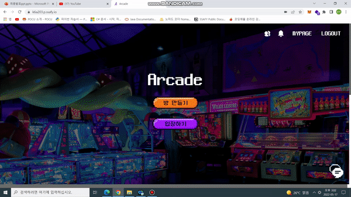
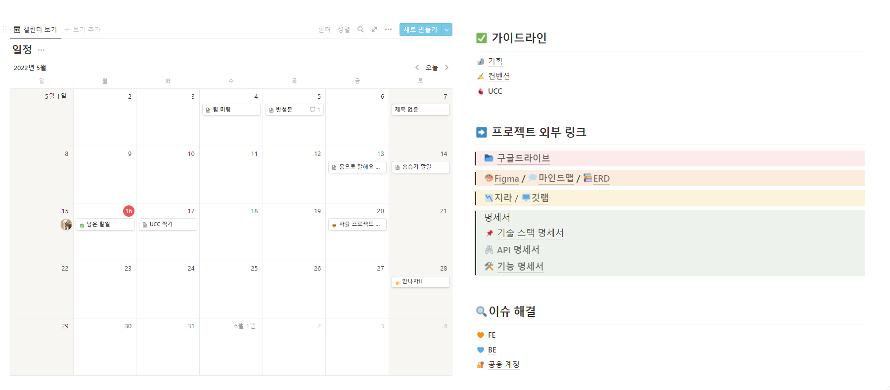

<div align="center">
  <br />
  
  <br />
  <h3>우리들만의 오락실 Arcade</h3>
  <br />
</div>


## 🎫 Overview

<div><h4>우리들만의 오락실 Arcade</h4></h4></div>

> 처음 만나는 사람들이 어색하고, 뭘 해야 할지 모르겠는 당신들을 위해 준비했습니다. 😏
>
> Arcade에서 준비한 게임을 통해서 우리 팀과 한걸음 더 가까워지세요! 😎

## 🎲 서비스 목표

- 처음만난 사람들과의 친밀함을 쌓는데 도움이 될 수 있도록 아이스브레이킹 게임을 제공한다.
- 접근성 향상을 위해 기본적으로 비회원으로 모든 게임을 이용 가능하도록 한다.
- 회원가입의 경우에도 접근성을 고려하여 소셜 로그인으로 구현한다.
- 실시간 채팅과 푸쉬알림을 통해 실시간 통신이 가능하도록 서비스를 구현한다.


## 🎮 주요기능 및 데모영상

**방 생성**



**초대받은 방 입장**


**캐치마인드**


**몸으로 말해요**


**너의 목소리가 들려**


**친구 추가 / 채팅**


**마이페이지**


## 🧭 프로젝트 기간

<div>
    <h4>22.04.11 ~ 22.05.20 (6주)</h4>
    <ul>
        <li>기획 및 설계: 22.04.11 ~ 22.04.17</li>
        <li>프로젝트 구현:  22.04.18 ~ 22.05.15</li>
        <li>버그 fix 및 산출물 정리: 22.05.16 ~ 22.05.20</li>
    </ul>
</div>


## ⚙ 개발 환경

**FE**

- IDE : VSCode
- Framework/Library : React, TypeScript

**BE**

- IDE : IntelliJ
- Framework : Spring boot
- JAVA : 8
- Build : Gradle
- WAS : Tomcat
- DBMS : MariaDB, Redis
- DB API : JPA

**Server**

- Server : AWS EC2
- Platform : Ubuntu

- Deploy : Docker


## 🔗 기술 스택 & 서비스 아키텍처

### 기술 스택

 </br>

</br>

</br>

</br>

 </br>


### 서비스 아키텍처


## 🔨 프로젝트 기획

<div><h5>Figma</h5></div>


<div><h5>Notion</h5></div>



<div><h5>ERD</h5></div>


## 📋 협업 관리

<div><h5>Git 컨벤션 규칙</h5></div>

```xml
commit 메시지 규칙: #Jira이슈번호 [Type] 수정사항 내역
```

**Type**

```xml
Add      -  코드 추가
Update   -  코드 수정
Remove   -  코드 삭제
Fix      -  버그 수정
Rename   -  단순 이름 변경	
Docs     -  문서 관련
```

**Example**

```xml
[Add] 로그인 유효성 검사 추가

[Docs] API 명세서 수정
```

<div><h5>JIRA 번다운 차트</h5></div>


## 🙂 개발 멤버 소개

<table>
    <tr>
      <td align="center">
        <h5>박현우</h5>
      </td>
      <td align="center">
        <h5>배하은</h5>
      </td>
      <td align="center">
        <h5>이상우</h5>
      </td>
      <td align="center">
        <h5>홍승기</h5>
      </td>
      <td align="center">
        <h5>주지환</h5>
      </td>
      <td align="center">
        <h5>김명섭</h5>
      </td>
    </tr>
    <tr>
        <td height="140px" align="center"> <a href="https://github.com/qweadzs">
             <br>Back-End</a></td>
        <td height="140px" align="center"> <a href="https://github.com/pear96">
             <br>Back-End</a></td>
        <td height="140px" align="center"> <a href="https://github.com/sangwooYi">
             <br>Back-End</a></td>
        <td height="140px" align="center"> <a href="https://github.com/hongseunggi">
             <br>Front-End</a></td>
        <td height="140px" align="center"> <a href="https://github.com/joojeehwan">
             <br>Front-End</a></td>
        <td height="140px" align="center"> <a href="https://github.com/kimms4142">
             <br>Front-End</a></td>        
    </tr>
    <tr>
      <td align="center" style="padding: 0px">
        Spring<br>Redis<br>SockJs
      </td>
      <td align="center">
        Docker<br>Jenkins<br>Linux<br>Openvidu
      </td>
      <td align="center">
        Spring<br>Openvidu
      </td>
      <td align="center">
        TypeScript<br>UI/UX<br>Openvidu
      </td>
      <td align="center">
        TypeScript<br>UI/UX<br>SockJS
      </td>
      <td align="center">
        TypeScript<br>UI/UX<br>Openvidu
      </td>    
    </tr>
</table>


