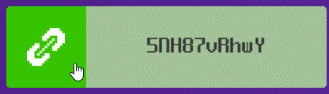
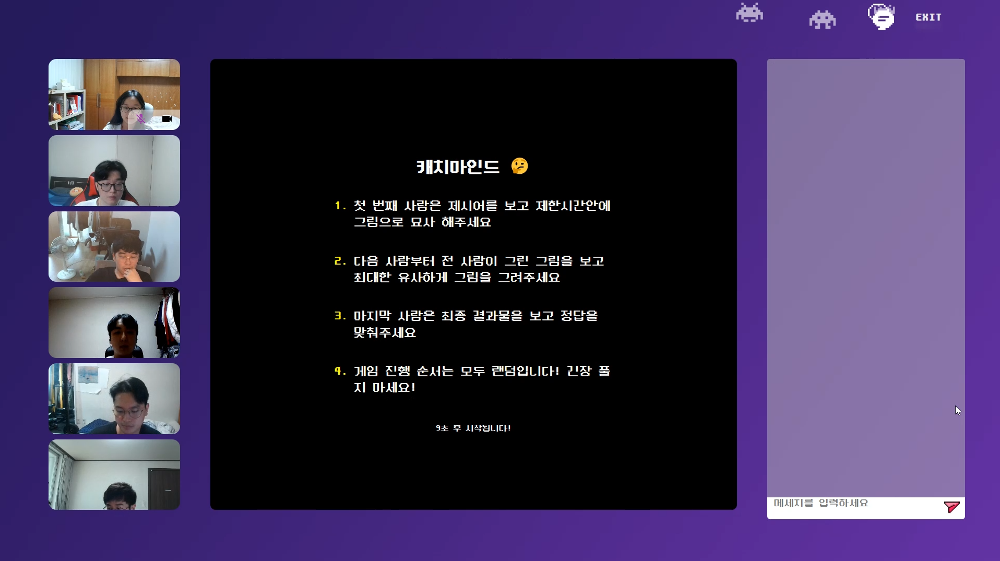

# 시연 시나리오

------

## 메인 페이지

> 로그인 없이도 서비스를 즐길 수 있습니다.
>
> 로그인을 하면 게임 기록과 다른 회원과의 1:1 채팅과 게임 초대가 가능합니다.

 

### 소셜 로그인 & 회원가입

> 카카오, 구글 OAuth를 활용해 로그인과 회원가입을 할 수 있습니다.

 

## 게임룸

### 방 만들기

> 닉네임을 설정하면 방을 생성할 수 있습니다. 한 방에는 최대 6명까지 접속할 수 있으며, 초대 코드가 자동으로 생성됩니다.

 

### 방 입장하기

> 초대 코드를 안다면 닉네임을 설정하고 입장할 수 있습니다. 
>
> 친구로 등록한 사람에게 초대를 받는다면 초대코드가 자동으로 입력되어있습니다.

 

### 대기실

> 방에 접속한 사람들을 볼 수 있으며, 접속한 사람들끼리 채팅이 가능합니다. 

#### 게임 선택 창

> 게임 선택 버튼을 누르면 3가지 게임 중 하나를 선택할 수 있습니다. 캐치마인드와 몸으로 말해요는 제시어 카테고리를 선택할 수 있습니다.

 

> 게임 선택 중에는 다른 사람은 대기합니다.

 

#### 초대코드 복사

> 버튼을 누르면 방에 입장할 수 있는 초대코드를 복사하게 됩니다.

 

#### 친구 초대

> 친구로 등록한 유저를 초대할 수 있습니다.

 

#### 1:1 채팅 가능

> 방 안에서도 친구로 등록한 다른 사용자와 1:1 채팅이 가능합니다.

 

## 게임 진행

## 캐치마인드

> 방에 참여한 사람들의 순서가 랜덤으로 섞이게 되고, 차례에 따라 그림을 그립니다.

 

> 제일 첫 번째 사람은 제시어를 보고 그림을 그립니다.

 

> 이후 두 번째 사람부터는 이전 사람이 그린 그림을 5초간 보고 제시어를 유추해 그림을 그립니다.
>
> 순서가 진행될 수록 그림을 그릴 수 있는 시간이 줄어듭니다.

 

> 마지막 차례의 사람은 그림을 보고 30초 내에 정답을 맞춥니다.

 

> 게임이 끝난 뒤 정답과 정답 여부, 그려진 그림을 모두 확인할 수 있고, 저장할 수 있습니다.

 

## 몸으로 말해요

> 방에 참여한 사람들의 순서가 랜덤으로 섞이게 되고, 차례에 따라 제시어에 맞춰 몸으로 표현합니다.
>
> 몸으로 표현하는 발표자는 마이크가 음소거 됩니다.

 

> 다른 참가자들은 발표자의 표현을 보고 정답을 맞춥니다. 정답을 맞춘 개수는 하단에 표시됩니다.
>
> 시간 내에 맞추지 못 하면 다음 순서로 넘어갑니다.

 

## 너의 목소리가 들려

> 방에 참여한 사람 중 랜덤으로 맞출 사람과, 찾아내야하는 사람이 정해집니다. 
>
> 맞추는 사람 외에 모두 캠이 꺼지고 높은 피치(Pitch) 또는 낮은 피치로 랜덤으로 목소리가 변조됩니다. 

> 맞추는 사람 외에는 누굴 찾아야하는지 알 수 없습니다.

 

> 맞추는 사람을 제외한 참여자들은 10초동안 자기 소개를 하고 이후 1분동안 대화를 나누게 됩니다.

 

> 발언자의 캠에는 하이라이트가 되어 누가 말하고 있는지 알 수 있습니다.

 

> 맞추는 사람은 자신이 찾는 사람이 있을 것 같다고 생각되는 캠을 선택합니다. 이후 결과를 확인할 수 있습니다.

 

## 친구

### 친구 목록

> 메인 페이지에서 사람 아이콘을 클릭하고 친구 목록을 확인할 수 있습니다.

 

### 친구 추가

> 이름을 검색하여 친구 요청을 보낼 수 있습니다.
>
> 친구 요청을 보내면 상대방의 화면에서는 알림이 오게 됩니다.
>
> 수락을 누르면 친구 관계를 맺을 수 있습니다.

 

## 채팅

### 대화방

> 채팅 아이콘을 누르면 현재까지 진행한 채팅방 목록을 확인할 수 있습니다.

 

### 대화방 추가

> 새로 채팅할 대화방을 열 수 있습니다.

 

## 마이페이지

### 게임 이력

> 자신의 프로필과 게임을 한 횟수, 정답을 맞춘 횟수를 확인할 수 있습니다.

 

### 저장한 그림

> 캐치마인드에서 저장한 그림 목록을 확인할 수 있습니다.

